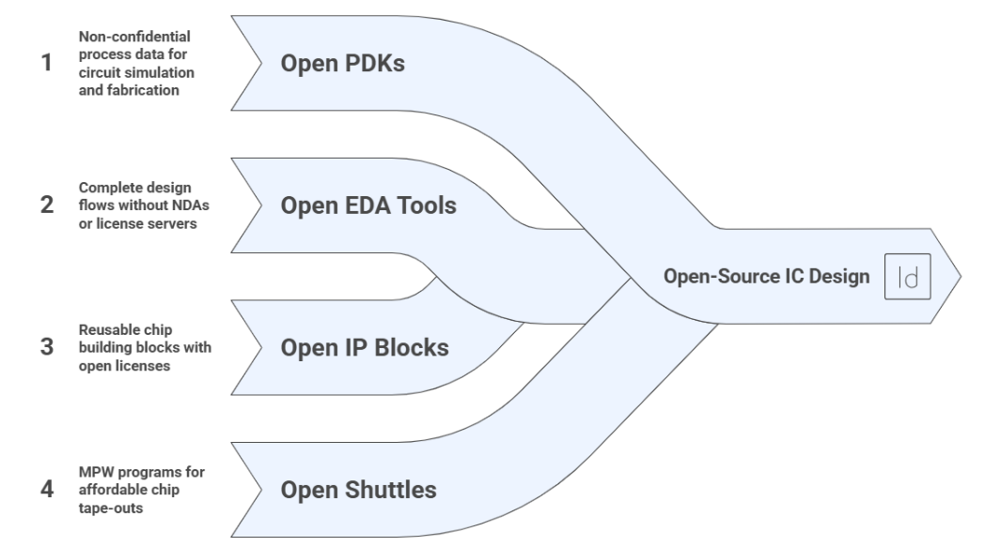
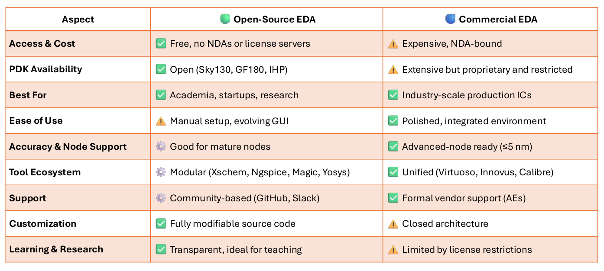
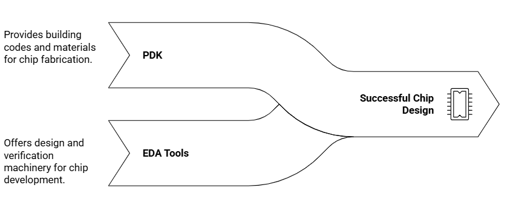
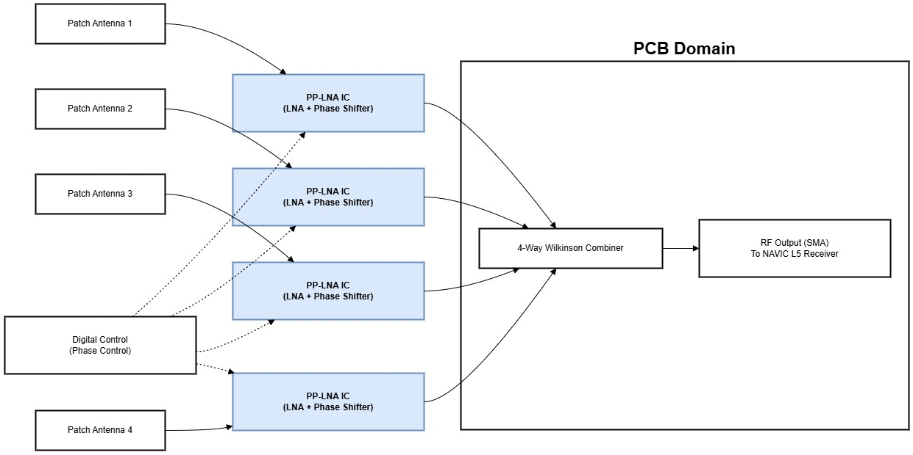

# Open-Source Phase-Programmable LNA semiconductor chip design for GNSS Beamforming 

## What this project is
This project is an **open-source RF IC reference design**: a **Phase-Programmable Low-Noise Amplifier (PP-LNA)** for **GNSS navigation applications**, implemented using the **IHP SG13G2 open PDK** and **open-source EDA software**.

It demonstrates that **serious RF silicon** can be designed and reused **without proprietary tools or restricted foundry access**.

The goal is not just one chip, but a **reproducible, teachable and extensible RFIC building block** for the open-source semiconductor ecosystem.

---

## Why open-source IC design matters (and why this exists)
For decades, IC or chip design has been inaccessible due to:

- expensive licensed EDA tools  
- closed, NDA-restricted PDKs  
- limited foundry access  

Open-source IC design removes these barriers by combining:

- **Open-source EDA tools** → schematic, simulation, layout, EM, verification  
- **Open PDKs** → legally usable transistor models and design rules  
- **Open collaboration** → designs that anyone can study, modify, and reuse  

This changes who can design chips:

- students can learn from *real* silicon designs  
- researchers can publish reproducible hardware  
- startups can prototype without expensive EDA tool licenses  

This project exists because **open-source ecosystem now makes RF IC design possible in the open**.

---

## How open EDA tools and PDKs work together
A simple mental model:

### Role of the PDK
- **PDK = building codes + materials**
  - available devices  
  - electrical behavior  
  - layout and fabrication rules  

### Role of EDA tools
- **EDA tools = design and verification machinery**
  - draw circuits  
  - simulate performance  
  - generate layout  
  - verify correctness  

Without tools → no design.  
Without a PDK → no fabrication.

This project uses the **IHP SG13G2 open PDK** end-to-end with open-source tools to demonstrate that this combination is **practically viable for RF IC design**, not just digital examples.

---

## Open-source EDA tools used
The project will be developed **using open-source EDA tools** together with the **IHP SG13G2 open PDK**. No proprietary or licensed tools are required.

### Schematic capture & circuit simulation
- **xschem** – schematic capture and netlisting  
- **Qucs-s** – schematic capture and netlisting especially for RF
- **ngspice** – DC/AC, transient, noise and RF simulations  
- **Xyce** (optional) – large-scale and parallel simulations  

### Layout & physical verification
- **KLayout** – full-custom RF/analog layout, DRC, LVS and GDS editing  
- **Netgen** – layout-vs-schematic (LVS) verification  

### Parasitic extraction & EM analysis
- **Magic** – layout inspection and parasitic extraction (where applicable)  
- **openEMS** – EM simulation of RF passives and interconnects  

### Flow automation & reproducibility
- **Python-based workflows** – simulation automation, result extraction and reproducibility  

### Why this matters
All tools listed are **free, open-source and legally usable** with the IHP open PDK.  
This enables reproducible RF IC design without dependence on commercial EDA licenses.

---

## What is LNA 
A **Low-Noise Amplifier (LNA)** is the **first active block after an antenna**.

Its job is simple: Amplify extremely weak signals while adding as little noise as possible.

If the LNA is poor, **no downstream processing can recover the RF wireless signal**.

### Everyday analogy
Think of the **LNB on a satellite TV dish**.

It amplifies a faint signal arriving from space before sending it down the cable. If it adds noise or distortion, the TV sees garbage.

This PP-LNA plays the same role — but for **satellite navigation signals**, where reliability and integrity are critical.

---

## Why GNSS signals need protection: jamming and spoofing
GNSS signals are **extremely weak** at the Earth’s surface — often **below the thermal noise floor**.

This makes them vulnerable to:

- **Jamming**: strong interference that overwhelms the receiver  
- **Spoofing**: malicious signals that imitate GNSS transmissions and mislead the receiver  

A single-antenna GNSS receiver has **no spatial awareness**. It cannot distinguish between genuine satellite signals and interference arriving from another direction.

As GNSS is increasingly used for **navigation, timing, aviation and autonomous systems**, resilience against these disruptions is essential.

---

## Why CRPA (Controlled Reception Pattern Antenna) is required
CRPA systems use **multiple antennas** and **spatial processing** to counter jamming and spoofing.

By controlling the relative phase of signals from each antenna, a CRPA system can:

- form beams toward real satellites  
- place spatial nulls toward jammers or spoofers  
- improve signal integrity without changing satellite signals  

To be effective, this spatial processing must occur **as early as possible** in the receiver chain.

That is where this PP-LNA fits.

---

## What this open-source project delivers
This design targets **NAVIC GNSS L5-band receivers** and supports:

- anti-jamming  
- anti-spoofing  
- CRPA (beamforming) antenna systems  

The PP-LNA integrates:

- a **low-noise CMOS LNA**  
- a **programmable RF phase shifter**  

Each antenna element uses one PP-LNA. Phase alignment is performed **in RF**, and signals are combined **before** the receiver.

This enables **analog beamforming** without requiring multiple high-speed ADCs or complex digital back-ends.

---

## Architecture overview

- one PP-LNA per antenna element  
- programmable RF phase control per path  
- external RF combiner (e.g., Wilkinson)  
- standard NAVIC receiver chain remains unchanged  

This modular approach allows CRPA capability to be added **without redesigning the entire receiver**.

---

## Project timeline (planned)
This is planned to be a **silicon-backed project**, not simulation-only work.

### Milestones
- **Design completion & sign-off**: March 2026  
- **Tapeout at IHP foundry**: March 2026  
- **Expected silicon delivery**: August–September 2026  
- **Die assembly & packaging**: October 2026  
- **Initial electrical & RF testing**: October 2026  
- **Final CRPA / beamforming system testing**: December 2026  

The objective is **end-to-end validation on fabricated silicon**, including spatial interference rejection.

---

## Why this matters to the open-source ecosystem
This project provides:

- a **reference RF/CRPA front-end** using an open PDK  
- a **teaching platform** for RF, GNSS, and beamforming  
- a **reproducible research baseline** for anti-jamming GNSS systems  
- proof that open-source silicon can address real-world security problems  

---

## License and scope
This is a **research / proof-of-concept** open-source design.
